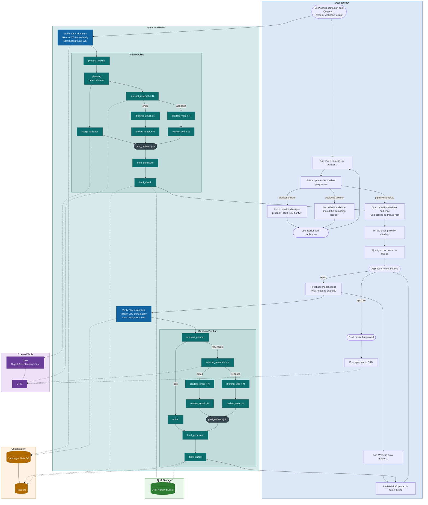

# User Journey

```mermaid
flowchart TD

 subgraph UX["User Journey"]
  direction TB

  u_brief(["User sends campaign brief\n@agent ...\nemail or webpage format"])
  u_ack["Bot: 'Got it, looking up product...'"]
  u_status["Status updates as pipeline progresses"]

  u_clarify_prod["Bot: 'I couldn't identify a product - could you clarify?'"]
  u_clarify_aud["Bot: 'Which audience should this campaign target?'"]
  u_reply(["User replies with clarification"])

  u_drafts["Draft thread posted per audience\nSubject line as thread root"]
  u_html["HTML email preview attached"]
  u_score["Quality score posted in thread"]
  u_buttons{{"Approve / Reject buttons"}}

  u_approved(["Draft marked approved"])
  u_crm_post["Post approval to CRM"]

  u_modal["Feedback modal opens\n'What needs to change?'"]
  u_revising["Bot: 'Working on a revision...'"]
  u_revised["Revised draft posted in same thread"]

  u_brief --> u_ack
  u_ack --> u_status
  u_status -->|product unclear| u_clarify_prod
  u_status -->|audience unclear| u_clarify_aud
  u_clarify_prod --> u_reply
  u_clarify_aud --> u_reply
  u_reply --> u_ack
  u_status -->|pipeline complete| u_drafts
  u_drafts --> u_html
  u_html --> u_score
  u_score --> u_buttons
  u_buttons -->|approve| u_approved
  u_approved --> u_crm_post
  u_buttons -->|reject| u_modal
  u_modal --> u_revising
  u_revising --> u_revised
  u_revised --> u_buttons
 end

 subgraph WORKFLOWS["Agent Workflows"]
  direction TB

  req["Verify Slack signature\nReturn 200 immediately\nStart background task"]

  subgraph PIPELINE["Initial Pipeline"]
   direction TB

   a_product["product_lookup"]
   a_planning["planning\ndetects format"]
   a_img["image_selector"]
   a_research["internal_research x N"]
   a_drafting_email["drafting_email x N"]
   a_drafting_web["drafting_web x N"]
   a_review_email["review_email x N"]
   a_review_web["review_web x N"]
   a_post_review(["post_review - join"])
   a_htmlgen["html_generator"]
   a_htmlcheck["html_check"]

   a_product --> a_planning
   a_planning --> a_img
   a_planning --> a_research
   a_img --> a_post_review
   a_research -->|email| a_drafting_email
   a_research -->|webpage| a_drafting_web
   a_drafting_email --> a_review_email
   a_drafting_web --> a_review_web
   a_review_email --> a_post_review
   a_review_web --> a_post_review
   a_post_review --> a_htmlgen
   a_htmlgen --> a_htmlcheck
  end

  req_rev["Verify Slack signature\nReturn 200 immediately\nStart background task"]

  subgraph REVISION["Revision Pipeline"]
   direction TB

   r_planner["revision_planner"]
   r_editor["editor"]
   r_research["internal_research x N"]
   r_drafting_email["drafting_email x N"]
   r_drafting_web["drafting_web x N"]
   r_review_email["review_email x N"]
   r_review_web["review_web x N"]
   r_post_review(["post_review - join"])
   r_htmlgen["html_generator"]
   r_htmlcheck["html_check"]

   r_planner -->|edit| r_editor
   r_planner -->|regenerate| r_research
   r_editor --> r_htmlgen
   r_research -->|email| r_drafting_email
   r_research -->|webpage| r_drafting_web
   r_drafting_email --> r_review_email
   r_drafting_web --> r_review_web
   r_review_email --> r_post_review
   r_review_web --> r_post_review
   r_post_review --> r_htmlgen
   r_htmlgen --> r_htmlcheck
  end

  req --> a_product
  req_rev --> r_planner
 end

 subgraph TOOLS["External Tools"]
  direction TB

  t_dam["DAM\nDigital Asset Management"]
  t_crm["CRM"]

  t_dam --- t_crm
 end

 subgraph OBS["Observability"]
  direction TB

  o_campaigns[("Campaign State DB")]
  o_traces[("Trace DB")]

  o_campaigns --- o_traces
 end

 subgraph STORAGE["Draft Storage"]
  direction TB

  o_bucket[("Draft History Bucket")]
 end

 u_brief --> req
 a_htmlcheck --> u_drafts

 u_modal --> req_rev
 r_htmlcheck --> u_revised

 a_img -.-> t_dam
 a_research -.-> t_crm
 r_research -.-> t_crm

 req -.-> o_campaigns
 req_rev -.-> o_campaigns
 a_htmlcheck -.-> o_traces
 r_htmlcheck -.-> o_traces
 a_htmlcheck -.-> o_bucket
 r_htmlcheck -.-> o_bucket
 u_crm_post -.-> t_crm

 classDef request fill:#1264A3,color:#fff,stroke:#0b4f8a
 classDef agent fill:#0d6e6e,color:#fff,stroke:#09494a
 classDef join fill:#37474f,color:#fff,stroke:#263238
 classDef tool fill:#6a3d9a,color:#fff,stroke:#4a2070
 classDef obs fill:#b26a00,color:#fff,stroke:#7a4900
 classDef storage fill:#2e7d32,color:#fff,stroke:#1b5e20

 class req,req_rev request
 class a_product,a_planning,a_img,a_research agent
 class a_drafting_email,a_drafting_web,a_review_email,a_review_web,a_htmlgen,a_htmlcheck agent
 class r_planner,r_editor,r_research agent
 class r_drafting_email,r_drafting_web,r_review_email,r_review_web,r_htmlgen,r_htmlcheck agent
 class a_post_review,r_post_review join
 class t_dam,t_crm tool
 class o_campaigns,o_traces obs
 class o_bucket storage

 style UX fill:#dce8f7,stroke:#1264A3,color:#000
 style WORKFLOWS fill:#d6eaea,stroke:#0d6e6e,color:#000
 style PIPELINE fill:#c2dcdc,stroke:#09494a,color:#000
 style REVISION fill:#c2dcdc,stroke:#09494a,color:#000
 style TOOLS fill:#ede0f7,stroke:#6a3d9a,color:#000
 style OBS fill:#fef3e2,stroke:#b26a00,color:#000
 style STORAGE fill:#e8f5e9,stroke:#2e7d32,color:#000
```
